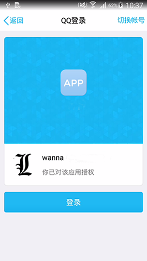

# ShareLoginLib
ShareLoginLib likes simple sharesdk or umeng in China . It is a tool to help developers to share their content (image , text or music ) to WeChat,Weibo and QQ.  


## 示例
 
## 准备工作

#### 1. 添加混淆参数
```  
# ————————  微信 start    ————————
-keep class com.tencent.mm.sdk.** {
   *;
}
# ————————  微信 end    ————————

# ————————  qq start    ————————
-keep class com.tencent.open.TDialog$*
-keep class com.tencent.open.TDialog$* {*;}
-keep class com.tencent.open.PKDialog
-keep class com.tencent.open.PKDialog {*;}
-keep class com.tencent.open.PKDialog$*
-keep class com.tencent.open.PKDialog$* {*;}
# ————————  qq end    ————————
```  

#### 2. 在包名下新建wxapi这个包，然后放入WXEntryActivity  
Activity的写法如下：  

```JAVA   
package 你自己的包名.wxapi;
import com.liulishuo.share.weixin.WeiXinHandlerActivity;

/**
 * -----------------------------------------------------------------------
 * 这是微信客户端回调activity.
 * 必须在项目包名下的wxapi中定义，类名也不能改。奇葩到一定境界了！
 * eg:com.kale.share是你的项目包名，那么这个类一定要放在com.kale.share.wxapi中才行。
 * 而且千万不要更改类名，请保持WXEntryActivity不变
 * WTF：真是微信蠢到家的设计，太愚蠢了
 * -----------------------------------------------------------------------
 */
public class WXEntryActivity extends WeiXinHandlerActivity {}
```

#### 3. 在项目工程的manifest中配置Activity  
```XML  
<!-- 腾讯的认证activity -->
<activity
    android:name="com.tencent.tauth.AuthActivity"
    android:launchMode="singleTask"
    android:noHistory="true"
    >
    <intent-filter>
        <action android:name="android.intent.action.VIEW" />

        <category android:name="android.intent.category.DEFAULT" />
        <category android:name="android.intent.category.BROWSABLE" />

        <!-- 这里需要换成:tencent+你的AppId -->
        <data android:scheme="tencent123456" />
    </intent-filter>
</activity>

<!-- 处理微信回调的Activity -->
<activity
    android:name=".wxapi.WXEntryActivity"
    android:exported="true"
    android:screenOrientation="portrait"
    android:theme="@android:style/Theme.NoDisplay"
    />  
```

## 如何使用
#### 1. 在项目中使用第三方SDK功能前进行参数的注册  
```java  
ShareBlock.getInstance()
              .initAppName("TestAppName")
              .initSharePicFile(getApplication())
              .initQQ(OAuthConstant.QQ_APPID, OAuthConstant.QQ_SCOPE)
              .initWeiXin(OAuthConstant.WEIXIN_APPID, OAuthConstant.WEIXIN_SECRET)
              .initWeiBo(OAuthConstant.WEIBO_APPID, OAuthConstant.WEIBO_REDIRECT_URL, OAuthConstant.WEIBO_SCOPE);
```  

#### 2. 进行登录、分享  
```JAVA  
// 登录
LoginManager.login(this, new LoginManager.LoginListener() {
      @Override
      public void onSuccess(String accessToken, String uId, long expiresIn, @Nullable String wholeData) {

      }

      @Override
      public void onError(String msg) {

      }

      @Override
      public void onCancel() {

      }
  }, LoginType.【WeiBo,WeiXin,QQ】);


// 分享
ShareManager.share(MainActivity.this，
        new ShareContentWebpage("title", "hello world!", "http://www.baidu.com", mBitmap)
        , ShareType.QQ_FRIEND
        , new ShareManager.ShareStateListener() {
                  @Override
                  public void onSuccess() {

                  }

                  @Override
                  public void onCancel() {

                  }

                  @Override
                  public void onError(String msg) {

                  }
              });

```   

#### 3. 判断本机是否安装第三方客户端  
```JAVA
ShareBlock.isWeiXinInstalled(this);
ShareBlock.isWeiBoInstalled(this);
ShareBlock.isQQInstalled(this);
```
更多详细的操作请参考项目源码。

## 测试用例  
1. 开启不保留活动
2. 未安装第三方应用  
3. 安装第三方应用，但第三方应用未登录  
4. 未开启不保留活动，并且第三方应用已经登录

## 已知的第三方SDK的bug（本lib无法解决）
- 首先不能信任第三方的回调，比如你分享到了微信，然后用户停在了微信，那么你就永远接收不到回调了。停留在他们的app一阵后，可能会因为内存不足等奇葩情况，你的应用被杀死。死了后怎么接收回调？  
- 如果你手机中安装了微信，并且微信已经登录。直接从你的应用分享到微信是没有任何回调的，只有在你用微信登录你的应用（无论登录是否成功，取消也行）后，才能有回调。   
- 当开启不保留活动后，有可能会出现界面的显示异常，这个和第三方的应用有密切关系，微博尤其明显。  

## LICENCE
-------------------------
  The MIT License (MIT)

  Copyright (c) 2015 LingoChamp Inc.

  Permission is hereby granted, free of charge, to any person obtaining a copy
  of this software and associated documentation files (the "Software"), to deal
  in the Software without restriction, including without limitation the rights
  to use, copy, modify, merge, publish, distribute, sublicense, and/or sell
  copies of the Software, and to permit persons to whom the Software is
  furnished to do so, subject to the following conditions:

  The above copyright notice and this permission notice shall be included in
  all copies or substantial portions of the Software.

  THE SOFTWARE IS PROVIDED "AS IS", WITHOUT WARRANTY OF ANY KIND, EXPRESS OR
  IMPLIED, INCLUDING BUT NOT LIMITED TO THE WARRANTIES OF MERCHANTABILITY,
  FITNESS FOR A PARTICULAR PURPOSE AND NONINFRINGEMENT. IN NO EVENT SHALL THE
  AUTHORS OR COPYRIGHT HOLDERS BE LIABLE FOR ANY CLAIM, DAMAGES OR OTHER
  LIABILITY, WHETHER IN AN ACTION OF CONTRACT, TORT OR OTHERWISE, ARISING FROM,
  OUT OF OR IN CONNECTION WITH THE SOFTWARE OR THE USE OR OTHER DEALINGS IN
  THE SOFTWARE.
